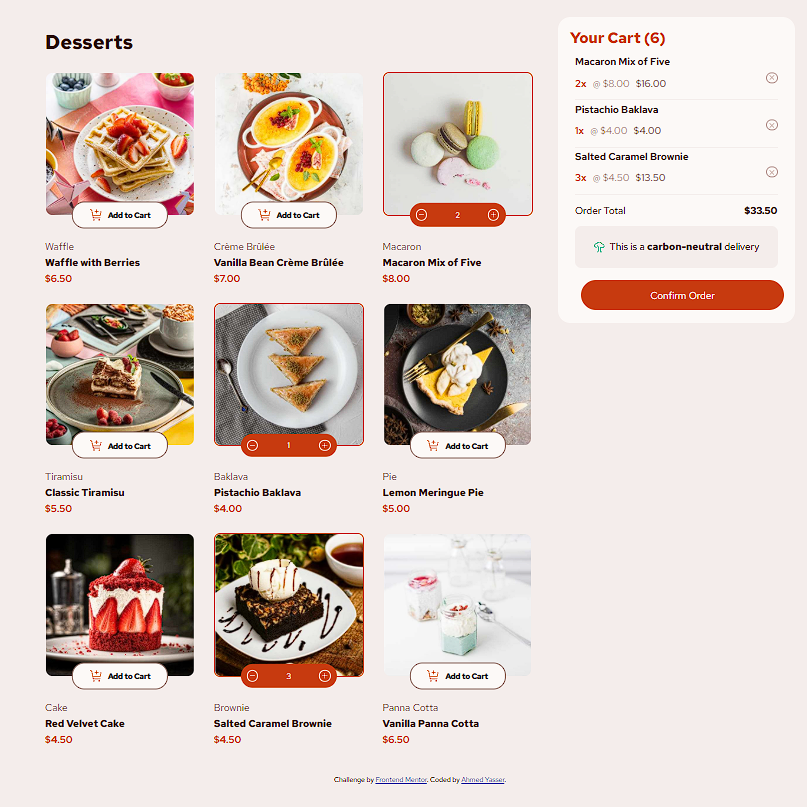

# Frontend Mentor - Product list with cart solution

This is a solution to the [Product list with cart challenge on Frontend Mentor](https://www.frontendmentor.io/challenges/product-list-with-cart-5MmqLVAp_d). Frontend Mentor challenges help you improve your coding skills by building realistic projects.

## Table of contents

- [Overview](#overview)
  - [The challenge](#the-challenge)
  - [Screenshot](#screenshot)
  - [Links](#links)
- [My process](#my-process)
  - [Built with](#built-with)
  - [Features](#features)
  - [What I learned](#what-i-learned)
  - [Future improvements](#future-improvements)
  - [AI Collaboration](#ai-collaboration)
- [Author](#author)

---

## Overview

### The challenge

Users should be able to:

- View all available products
- Add products to the cart
- Increase and decrease product quantities
- Remove products from the cart
- See the total order price update automatically
- Confirm the order through a confirmation modal
- Start a new order after confirmation
- Keep cart data after refreshing the page using Local Storage
- View the optimal layout depending on their device's screen size
- See hover and focus states for interactive elements

### Screenshot

### Links

- Solution URL:
- Live Site URL:

---

## My process

### Built with

- Semantic HTML5
- CSS3
- Flexbox
- CSS Grid
- Vanilla JavaScript (ES6)
- Fetch API
- Local Storage
- Mobile-first workflow

---

### Features

- Dynamic product rendering from a JSON file using the Fetch API.
- Shopping cart built completely with JavaScript.
- Increase and decrease product quantities.
- Remove products from the cart.
- Automatic order total calculation.
- Order confirmation modal.
- Start New Order functionality.
- Cart persistence using Local Storage.
- Responsive design for mobile, tablet, and desktop.
- Product images change automatically depending on screen size.

---

### What I learned

This project helped me practice real-world JavaScript concepts, including:

- Working with the Fetch API to load external JSON data.
- Manipulating the DOM dynamically.
- Creating reusable functions instead of repeating code.
- Managing application state using arrays of objects.
- Saving and restoring data with Local Storage.
- Updating the UI based on application state.
- Handling events on dynamically created elements.
- Organizing JavaScript code into smaller reusable functions.

This project also improved my understanding of state management without using any JavaScript framework.

---

### Future improvements

Some features I'd like to add in the future include:

- Product animations while adding to the cart.
- Toast notifications.
- Better code organization using JavaScript modules.
- Refactoring into reusable classes or components.
- Rebuilding the project using React.

---

### AI Collaboration

I used ChatGPT during development to:

- Debug JavaScript issues.
- Improve code organization.
- Refactor repeated code into reusable functions.
- Better understand Local Storage.
- Review my overall project structure.

The implementation and logic were written and customized by me after understanding each solution rather than simply copying generated code.

---

## Author

- GitHub - https://github.com/ahmedyasser006200
- Frontend Mentor - https://www.frontendmentor.io/profile/ahmedyasser006200
